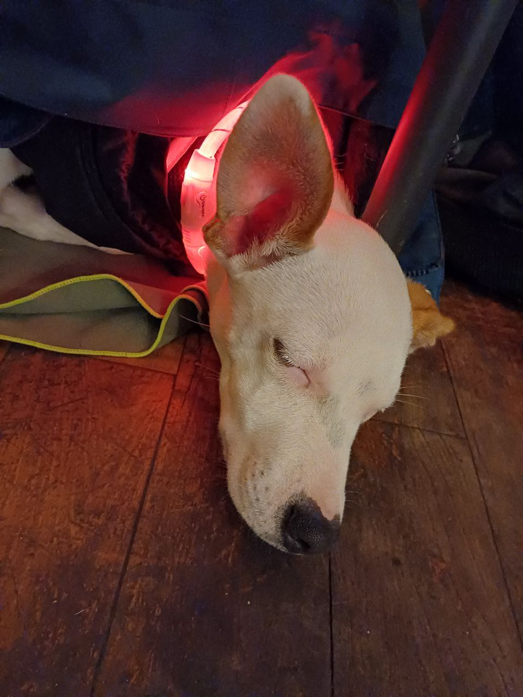

# 
Trofia Manual

  

### Vielen Dank fürs Hüten von Trofia!
Hier ist die Anleitung, um euch das Leben mit Trofia zu erleichtern:

---

## Wichtige Hinweise:
- Trofia hat schnell kalt, daher sollte sie im Winter draußen nicht lange ohne Bewegung sein.
- Zieh ihr eine Jacke an, aber in der Sonne geht es auch mal ohne.
- Wenn sie zu kalt hat, wird sie unruhig – das merkt man gut.
- Im Haus beruhigen Wärme (Pullover, Decken) und Nähe ihre Unruhe.
- Ihr Halsband ist nur für die Plakette und nicht für die Leine geeignet, um ihren langen Windhundhals zu schonen.
- Fütterung: Morgens und abends eine gut gefüllte rote Plastiktasse Trockenfutter.
- Gudies und Kauknochen helfen, wenn sie unruhig wird. Sie zahnt noch.
- **Sie ist stubenrein**, kann auch gut eine Nacht aushalten. Wenn sie muss, kommt sie uns normalerweise anstupsen oder an den Zehen knabbern.

---

## Beim Spazierengehen:
- Immer an der Leine, wo es Autos gibt. Sie jagt Vögeln nach.
- An ungefährlichen Orten kann sie nach eigenem Ermessen von der Leine gelassen werden.
- Nach einem gemeinsamen Abend auf dem Sofa gehört man für Trofia zum Rudel.

---

## Sozialverhalten:
- Mit Kindern und Hunden kommt sie gut zurecht.
- Sehr lebhafte Kinder (z. B. ADHS) sind ihr nicht ganz geheuer – sie zieht sich zurück.
- Beim Spielen mit anderen Hunden kann sie in einen Hyperzustand kommen.  
  Dann hilft es, sie zu sich zu rufen, sitzen zu lassen und kurz zu beruhigen.
- An der kurzen Leine ist sie ruhiger – das gilt auch für unruhige Momente im Haus.

---

## Erziehung:
- **Hochspringen/Hochsteigen** sollte sie nicht. Ignorieren oder wegwischen mit einem "Nein", und wenn sie unten ruhig ist, kann man Zuwendung geben.
- **Wenn du isst**, bekommt sie nichts. Bitte zeitversetzt an ihrer Fütterungsstation füttern.
- Kommandos wie "Ven", "Warte", "Sentada" und "Nei" lassen sich gut an der Leine üben.
- **Beim "Ven"**: Nur einmal rufen. Läuft sie los, Party machen ("Feini Trofia!").  
  Falls sie nicht kommt: laut rufen oder pfeifen, wenn möglich entgegengesetzt laufen, in Büsche/Felder abbiegen oder sich verstecken.

---

## Kommandos:

| **Kommando**  | **Deutsch**       | **Español**     | **Italiano**    |
|---------------|-------------------|-----------------|-----------------|
| Ven           | Komm              | Ven             | Vieni           |
| Warte         | Warten            | Espera          | Aspetta         |
| Nei           | Nein              | No              | No              |
| Sentada       | Sitz              | Sentada         | Seduto          |
| Abajo         | Platz             | Abajo           | Terra           |
| Siloh         | Aus               | Fuera           | Fuori           |
| Rolle         | Rollen            | Rueda           | Rotola          |
| Hopp          | Spring            | Salta           | Salta           |
| Juntos        | Bei Fuß           | Juntos          | Al passo        |
| Feini         | Brava             | Buena           | Brava           |
| Pipi mache    | Pipi machen       | Hacer pipi      | Fare pipì       |
| Popo mache    | Popo machen       | Hacer popó      | Fare popò       |

